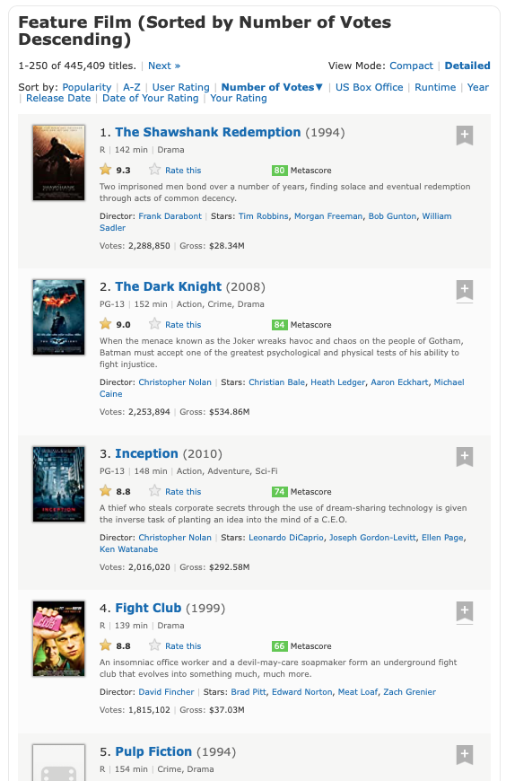

---
jupytext:
  cell_metadata_filter: '-all'
  formats: 'md:myst'
  text_representation:
    extension: .md
    format_name: myst
    format_version: '0.8'
    jupytext_version: 1.5.0
kernelspec:
  display_name: Python 3
  language: python
  name: python3
---

# Regularni izrazi

Običajno moramo podatke, ki jih želimo analizirati, najprej prečistiti. Na primer, svetovni splet je bogat vir podatkov, vendar so ti dostikrat dostopni le v formatu HTML, ki poleg koristne vsebine vsebuje še marsikaj. Recimo, da nas zanimajo podatki o [250 filmih z največ glasovi na strani IMDB](https://www.imdb.com/search/title/?sort=num_votes,desc&title_type=feature&count=250). Vidimo, da stran ponuja veliko koristnih podatkov: naslov, leto izida, dolžno, žanre, ocene, igralce, opise, ...



Če pa v brskalniku shranimo izvorno kodo in HTML datoteko odpremo, pa je podatke težko najti.

```{code-cell}
with open('datoteke/250-najbolj-znanih-filmov.html') as f:
    html = f.read()

print(html[:1000])
```

Pomagajmo si s pomožno funkcijo, ki poišče začetke in konce vseh neprekrivajočih se pojavitev danega niza v besedilu.

```{code-cell}
def vse_pojavitve(besedilo: str, iskani_niz: str):
    konec_pojavitve = 0
    while True:
        try:
            zacetek_pojavitve = besedilo.index(iskani_niz, konec_pojavitve)
            konec_pojavitve = min(zacetek_pojavitve + len(iskani_niz), len(besedilo))
            yield zacetek_pojavitve, konec_pojavitve
        except ValueError:
            break
```

```{code-cell}
list(vse_pojavitve('Ena sama je, mama!', 'ma'))
```

Če želimo, lahko vsako pojavitev prikažemo v njenem kontekstu:

```{code-cell}
def pokazi_vse_pojavitve(besedilo: str, iskani_niz: str, velikost_konteksta=50):
    for zacetek, konec in vse_pojavitve(besedilo, iskani_niz):
        zacetek_konteksta = max(zacetek - velikost_konteksta, 0)
        konec_konteksta = min(konec + velikost_konteksta, len(besedilo))
        print(besedilo[zacetek_konteksta:konec_konteksta])
        print((zacetek - zacetek_konteksta) * ' ' + (konec - zacetek) * '^')
```

```{code-cell}
pokazi_vse_pojavitve('Ena sama je, mama!', 'ma')
```

Recimo, da nas zanimajo podatki o Vojni zvezd:

```{code-cell}
pokazi_vse_pojavitve(html.replace('\n', ''), 'Star Wars')
```

V datoteki najdemo kar nekaj pojavitev, za vsako epizodo po dve: eno iz prikaza naslova in eno iz opisa slike. Vidimo, da so vsi naslovi podobne oblike: na začetku je značka `<a href="/title/tt0123456/?ref_=adv_li_tt">`, pri čemer se šifra spreminja od filma do filma, na koncu je `</a>`, med njima pa je naslov filma. Če bi se zelo potrudili, bi lahko spisali program, ki iz takega niza izlušči šifro in naslov.

```{code-cell}
def izlusci_sifro_in_naslov(niz):
    pred_sifro = '<a href="/title/tt'
    med_sifro_in_naslovom = '/?ref_=adv_li_tt">'
    za_naslovom = '</a>'
    zacetek_sifre = niz.index(pred_sifro) + len(pred_sifro)
    konec_sifre = niz.index(med_sifro_in_naslovom)
    zacetek_naslova = konec_sifre + len(med_sifro_in_naslovom)
    konec_naslova = niz.index(za_naslovom)
    sifra = int(niz[zacetek_sifre:konec_sifre])
    naslov = niz[zacetek_naslova:konec_naslova]
    return sifra, naslov
```

```{code-cell}
izlusci_sifro_in_naslov('<a href="/title/tt0076759/?ref_=adv_li_tt">Star Wars: Episode IV - A New Hope</a>')
```

```{code-cell}
izlusci_sifro_in_naslov('<a href="/title/tt0086190/?ref_=adv_li_tt">Star Wars: Episode VI - Return of the Jedi</a>')
```

Podobno bi lahko naredili še za leto izida, dolžino in ostalo, vendar mora obstajati boljši način. Mi si bomo pogledali dva. Prvi način so regularni izrazi - ti so univerzalno (z manjšimi dialekti) razširjeni zapis vzorcev nizov, ki jih lahko uporabljamo za delo s kakršnim koli besedilom. Regularne izraze podpirajo praktično vsi programski jeziki in naprednejši urejevalniki besedil. Zaradi vseobče uporabnosti se bomo regularnim izrazom bolj posvetili, niso pa vedno najboljše orodje pri roki, saj zaradi splošnosti ne izkoristijo vse strukture, ki je na voljo. Zato si bomo ogledali še drugi način, knjižnico [Beautiful Soup](https://www.crummy.com/software/BeautifulSoup/), ki je namenjena analizi HTML datotek.

## Regularni izrazi v Pythonu

Za delo z regularnimi izrazi (ali regeksi) v Pythonu uporabljamo knjižnico [`re`](https://docs.python.org/3/library/re.html), ki je vključen v vsako različico Pythona. V njej je najbolj osnovna funkcija `search`, ki sprejme vzorec in besedilo, v katerem iščemo, ter vrne prvo pojavitev, predstavljeno z objektom razreda `re.Match`.

```{code-cell}
import re
re.search('ma', 'Ena sama je, mama!')
```

V objektu imamo dostop do začetka in konca pojavitve in njene vsebine. Uporabimo lahko tudi funkcijo `re.finditer`, ki vrne iterator po vseh pojavitvah:

```{code-cell}
list(re.finditer('ma', 'Ena sama je, mama!'))
```

S pomočjo te funkcije lahko na veliko bolj enostaven način napišemo funkcijo `vse_pojavitve`.

```{code-cell}
def vse_pojavitve(besedilo: str, vzorec: str):
    for pojavitev in re.finditer(vzorec, besedilo):
        yield pojavitev.start(), pojavitev.end()
```

```{code-cell}
pokazi_vse_pojavitve('Ena sama je, mama!', 'ma')
```

Seveda pa regularni izrazi pokažejo svojo pravo moč, ko začnemo uporabljati še ostale vzorce. Vse lahko najdete v [uradni dokumentaciji](https://docs.python.org/3/library/re.html#regular-expression-syntax), mi pa si poglejmo najbolj pogoste.

### Vzorci za znake

Katerikoli znak predstavimo s piko:

```{code-cell}
pokazi_vse_pojavitve('Ena sama je, mama!', '.a')
```

```{code-cell}
pokazi_vse_pojavitve('Ena sama je, mama!', '.m')
```

Piko samo predstavimo z vzorcem `\.`. Pri tem je potrebno upoštevati, da je vzorec sestavljen iz dveh znakov: poševnice in pike, zato je treba v Pythonu za poševnico uporabiti ubežni znak:

```{code-cell}
pokazi_vse_pojavitve('akad. prof. dr. Jana Obvlada', '\\.')
```

Ker veliko vzorcev uporablja poševnice, dvojne poševnice pa je nadležno pisati, bomo raje uporabili _surove_ nize, v katerih Python ne uporablja ubežnih znakov in `\` pomeni preprosto `\`. Dobimo tako, da pred narekovaj napišemo `r`.

```{code-cell}
pokazi_vse_pojavitve('akad. prof. dr. Jana Obvlada', r'\.')
```

Običajno surove nize uporabljamo za zapis regularnih izrazov (tudi Visual Studio Code v surovih nizih obarva regularne izraze), vendar `r` ne pomeni _regex_ temveč _raw_.

Vse števke predstavimo z vzorcem `\d`, vse črke z vzorcem `\w`, vse bele znake (presledke, tabulatorje, znake za novo vrstico) pa z vzorcem `\s`:

```{code-cell}
pokazi_vse_pojavitve('Potrebujem 500g moke.', r'\d+')
```

```{code-cell}
pokazi_vse_pojavitve('Potrebujem 500g moke.', r'\w+')
```

```{code-cell}
pokazi_vse_pojavitve('Potrebujem 500g moke.', r'\s+')
```

Če uporabimo veliko tiskano črko, dobimo komplement. Tako vzorcu `\D` ustrezajo vsi znaki razen števk, vzorcu `\W` vsi znaki razen črk, vzorcu `\S` pa vsi znaki razen belih.

```{code-cell}
pokazi_vse_pojavitve('Potrebujem 500g moke.', r'\D+')
```

```{code-cell}
pokazi_vse_pojavitve('Potrebujem 500g moke.', r'\W+')
```

```{code-cell}
pokazi_vse_pojavitve('Potrebujem 500g moke.', r'\S+')
```

Če se želimo omejiti na posamezne znake ali posamezen razpon zaporednih znakov, jih naštejemo med oglatimi oklepaji:

```{code-cell}
pokazi_vse_pojavitve('ata, mama, teta, stric', r'.[aeiou].')
```

```{code-cell}
pokazi_vse_pojavitve('ata, mama, teta, stric', r'.[aeiou][a-z]')
```

Če kot prvi znak v oglatih oklepajih damo `^`, dobimo komplement:

```{code-cell}
pokazi_vse_pojavitve('ata, mama, teta, stric', r'.[^aeiou].')
```

### Kvantifikatorji

Z `*` označimo poljubno mnogo ponovitev danega vzorca:

```{code-cell}
pokazi_vse_pojavitve('Oddal sem davčno napoved', r'd*a')
```

Če želimo, da se vzorec pojavi vsaj enkrat, uporabimo `+`:

```{code-cell}
pokazi_vse_pojavitve('Oddal sem davčno napoved', r'd+a')
```

Kvantifikatorja `*` in `+` sta požrešna, kar pomeni, da poskusita zajeti kolikor znakov lahko:

```{code-cell}
pokazi_vse_pojavitve('Oddal sem davčno napoved', r'd.*a')
```

```{code-cell}
pokazi_vse_pojavitve('Oddal sem davčno napoved', r'd.+a')
```

Če želimo najti najkrajše možne pojavitve, moramo na koncu dodati še `?`:

```{code-cell}
pokazi_vse_pojavitve('Oddal sem davčno napoved', r'd.*?a')
```

```{code-cell}
pokazi_vse_pojavitve('Oddal sem davčno napoved', r'd.+?a')
```

Če uporabimo samo `?`, to pomeni morebitno pojavitev vzorca:

```{code-cell}
pokazi_vse_pojavitve('Oddal sem davčno napoved', r'da?')
```

Če želimo dobiti znake `*`, `+` in `?` uporabimo `\*`, `\+` in `\?`.

Kvantifikatorji `*`, `+` in `?` so posebni primeri kvantifikatorja `{m,n}`, ki predstavlja katerokoli število ponovitev med `m` in `n`, pri čemer lahko kakšno izmed meja tudi izpustimo. Tako je kvantifikator `*` okrajšava za `{0,}`, kvantifikator `+` okrajšava za `{1,}`, kvantifikator `?` pa okrajšava za `{0,1}`.

```{code-cell}
pokazi_vse_pojavitve('"Brrrr, brrrrrr, brrr, brrrrrrr," je drgetal od mraza.', r'[Bb]r{4,5}')
```

```{code-cell}
pokazi_vse_pojavitve('"Brrr, brrrrrr, brrr, brrrrrrr," je drgetal od mraza.', r'[Bb]r{4,}')
```

```{code-cell}
pokazi_vse_pojavitve('"Brrr, brrrrrr, brrr, brrrrrrr," je drgetal od mraza.', r'[Bb]r{,5}')
```

### Skupine

Vzorce lahko z oklepaji združujemo v skupine:

```{code-cell}
pokazi_vse_pojavitve('tralala hopsasa', r'([^aeiou][aeiou])+')
```

V pojavitvi lahko do posameznih skupin dostopamo prek metode `group`. Celotna pojavitev ima indeks `0`, nato pa so oštevilčene glede na uklepaje:

```{code-cell}
recept = 'Potrebujem 500 g moke in 250 ml vode.'
vzorec = r'(\d+) (\w+)'
for pojavitev in re.finditer(vzorec, recept):
    print(f'enota: {pojavitev.group(2)}, vrednost: {pojavitev.group(1)}')
```

Dostikrat je koristno, da skupine poimenujemo, kar storimo tako, da skupino pišemo kot `(?P<ime_skupine>...)`. Do vseh skupin potem dostopamo prek metode `groupdict`:

```{code-cell}
vzorec = r'(?P<kolicina>\d+) (?P<enota>\w+)'
[pojavitev.groupdict() for pojavitev in re.finditer(vzorec, recept)]
```

Zgornjo funkcijo bi tako lepše napisali kot:
```{code-cell}
def izlusci_sifro_in_naslov(niz):
    vzorec = r'<a href="/title/tt(?P<sifra>\d+)/\?ref_=adv_li_tt">(?P<naslov>.*?)</a>'
    pojavitev = re.search(vzorec, niz)
    sifra = int(pojavitev.group('sifra'))
    naslov = pojavitev.group('naslov')
    return sifra, naslov
```

```{code-cell}
izlusci_sifro_in_naslov('<a href="/title/tt0076759/?ref_=adv_li_tt">Star Wars: Episode IV - A New Hope</a>')
```

```{code-cell}
izlusci_sifro_in_naslov('<a href="/title/tt0086190/?ref_=adv_li_tt">Star Wars: Episode VI - Return of the Jedi</a>')
```

## Metode za delo z regularnimi izrazi

V knjižnici `re` je na voljo več funkcij za delo z regularnimi izrazi:

- `search`, ki vrne prvo pojavitev danega vzorca v nizu oziroma `None`, če je ni:

  ```{code-cell}
  re.search(r'\d', '3, 4, zdaj!')
  ```

  ```{code-cell}
  re.search(r'\d', 'tri, štiri, zdaj!')
  ```

- `match`, ki vrne pojavitev, če ta ustreza začetku niza oziroma `None`, če ne:

  ```{code-cell}
  re.match(r'\d+', '500 g moke')
  ```

  ```{code-cell}
  re.match(r'\d+', 'Potrebujem 500 g moke.')
  ```

- `fullmatch`, ki vrne pojavitev, če ta ustreza celotnemu nizu oziroma `None`, če ne:

  ```{code-cell}
  re.fullmatch(r'\w+', 'Proseminar')
  ```

  ```{code-cell}
  re.fullmatch(r'\w+', 'Uvod v programiranje')
  ```

- `finditer`, ki vrne iterator čez vse pojavitve vzorca v nizu:

  ```{code-cell}
  list(re.finditer(r'\d', '3, 4, zdaj!'))
  ```

- `findall`, ki vrne seznam vsebin vseh pojavitev vzorca v nizu:

  ```{code-cell}
  re.findall(r'\d', '3, 4, zdaj!')
  ```

- `findall`, ki vrne seznam vsebin vseh pojavitev vzorca v nizu:

  ```{code-cell}
  re.findall(r'\d', '3, 4, zdaj!')
  ```

- `split`, ki dani niz razdeli po pojavitvah:

  ```{code-cell}
  re.split(r'[aeiou]', 'otorinolaringolog')
  ```

- `sub`, ki v danem nizu pojavitve zamenja z drugimi nizi, v katerih lahko do posameznih skupin dostopamo prek `\1`, `\2`, ...

  ```{code-cell}
  def daj_en_presledek_za_vsako_stevilko(niz):
      stevilka_in_morebitni_presledki = r'(\d+)\s*'
      return re.sub(stevilka_in_morebitni_presledki, r'\1 ', niz)
  ```

  ```{code-cell}
  daj_en_presledek_za_vsako_stevilko('500g moke in 250    ml vode')
  ```

Vse zgoraj omenjene funkcije poleg običajnih argumentov sprejmejo še dodatne parametre, ki jih imenujemo zastavice in malenkostno spreminjajo iskanje. Na primer, z `re.IGNORECASE` pri iskanju ne razlikujemo med malimi in velikimi črkami:

```{code-cell}
re.findall(r'a', 'Abraham')
```

```{code-cell}
re.findall(r'a', 'Abraham', flags=re.IGNORECASE)
```

Druga pogosto uporabljana zastavica je `re.DOTALL`. Vzorec `.` običajno pomeni vse znake razen znaka za novo vrstico. Če uporabimo `re.DOTALL`, pa vključuje tudi tega:


```{code-cell}
re.findall(r'X.*?Y', 'XyzzY X    Y X\nY')
```

```{code-cell}
re.findall(r'X.*?Y', 'XyzzY X    Y X\nY', flags=re.DOTALL)
```

Če želimo uporabiti več zastavic, jih v eno sestavimo z `|`:

```{code-cell}
re.findall(r'X.*?Y', 'XyzzY x    y X\nY', flags=(re.DOTALL|re.IGNORECASE))
```

Vse zgoraj omenjene funkcije sprejmejo niz z vzorcem, ki ga iščemo. Še bolj Pythonovsko in tudi bolj učinkovito, če vzorec uporabljamo večkrat, pa je, da vzorec s funkcijo `compile` pretvorimo v objekt `re.Pattern`. Na takem objektu lahko potem kličemo metode z istimi imeni kot zgoraj omenjene funkcije.

## Knjižnica Beautiful Soup
