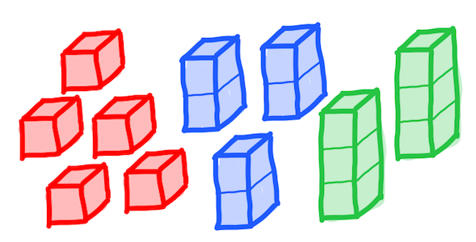
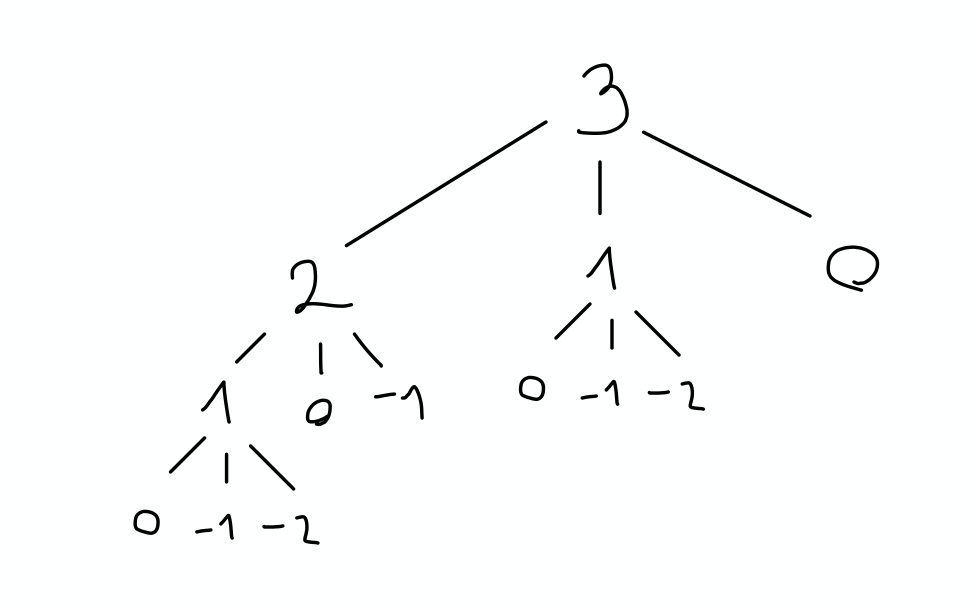

---
jupytext:
  text_representation:
    extension: .md
    format_name: myst
    format_version: 0.12
    jupytext_version: 1.8.0
kernelspec:
  display_name: Python 3
  language: python
  name: python3
---

# Dinamično programiranje

Recimo, da imamo veliko kock velikosti 1, 2 in 3, vsako v svoji barvi. Zanima nas, koliko različnih stolpov lahko sestavimo iz njih.



Na primer, sestavimo lahko štiri različne stolpe višine 3: `1 1 1`, `1 2`, `2 1` in `3`. V splošnem lahko vidimo, da so stolpi višine $n$ treh različnih oblik:

1. na dnu je kocka velikosti 1, nad njo pa stolp višine $n - 1$,
2. na dnu je kocka velikosti 2, nad njo pa stolp višine $n - 2$,
3. na dnu je kocka velikosti 3, nad njo pa stolp višine $n - 3$.

Pri tem moramo paziti še na robne pogoje, ki jih najbolj enostavno zapišemo tako, da je stolp ničelne višine natanko en, stolpov negativne višine pa ni:

```{code-cell}
def stevilo_stolpov(n):
    if n < 0:
        return 0
    elif n == 0:
        return 1
    else:
        return sum(stevilo_stolpov(n - k) for k in [1, 2, 3])
```

```{code-cell}
stevilo_stolpov(3)
```

```{code-cell}
stevilo_stolpov(10)
```

Čas za izračun števila stolpov višine $n$ hitro narašča:

```{code-cell}
%timeit stevilo_stolpov(10)
```

```{code-cell}
%timeit stevilo_stolpov(11)
```

```{code-cell}
%timeit stevilo_stolpov(12)
```

Razlog za to je v podvojevanju izračunov. Na primer, poglejmo, katere vrednosti moramo izračunati, da ugotovimo število stolpov višine 3:



Funkcijo moramo poklicati trinajstkrat. Število klicev bi s posebnimi primeri lahko zmanjšali, vendar je eksponentna rast neizogibna. Vidimo, da pri klicih prihaja do podvojitev. Strategiji, s katero se jim izognemo, pravimo _dinamično programiranje_. Intuitivno je struktura podnalog videti približno takole:


Podvojevanju se lahko izognemo na dva načina. Prvi je _memoizacija_, pri kateri si računalnik samodejno shranjuje izračunane rezulate in jo bomo pogledali naslednjič. Drugi pa je pristop _od spodaj navzgor_, v katerem rešitve pripravimo v ustreznem vrstnem redu. Takih vrstnih redov je lahko več, saj moramo poskrbeti le za to, da so vse podnaloge pravočasno rešene:


V primeru računanja števila stolpov je tak vrstni red samo en: od $1$ do $n$, zato ni vprašanja, kako se bomo lotili dela. Vsako izračunano vrednost si bomo shranili v seznam in nadaljevali z naslednjo. V resnici ne potrebujemo vseh izračunanih vrednosti, temveč samo zadnje tri:

```{code-cell}
def hitro_stevilo_stolpov(n):
    stevilo, stevilo_minus_1, stevilo_minus_2 = 1, 0, 0
    for i in range(n):
        novo_stevilo = stevilo + stevilo_minus_1 + stevilo_minus_2
        stevilo, stevilo_minus_1, stevilo_minus_2 = novo_stevilo, stevilo, stevilo_minus_1
    return stevilo
```

```{code-cell}
hitro_stevilo_stolpov(3)
```

```{code-cell}
hitro_stevilo_stolpov(10)
```

Nova funkcija deluje mnogo hitreje in sicer v linearnem času.

```{code-cell}
%timeit hitro_stevilo_stolpov(10)
```

```{code-cell}
%timeit hitro_stevilo_stolpov(100)
```

```{code-cell}
%timeit hitro_stevilo_stolpov(1000)
```

```{code-cell}
hitro_stevilo_stolpov(10000)
```

Nalogo se da rešiti tudi v logaritemskem času, se spomnite kako?

## Najcenejša pot v matriki

Malo zahtevnejši primer je iskanje najcenejše poti iz zgornjega levega v spodnji desni kot matrike, pri čemer se lahko premikamo le desno in navzdol. V spodnji matriki je ta pot označena s krepkimi števkami:

| | | | | |
|:-----: | :----: | :-----: | :-----: | :-----:
|**131** | 673 | 234 | 103 | 18
|**201** | **96** | **342** | 965 | 150
|630 | 803 | **746** | **422** | 111
|537 | 699 | 497 | **121** | 956
|805 | 732 | 524 | **37** | **331**

Eden izmed načinov, kako to nalogo razbijemo na manjše, je, da si ogledamo prvi korak. Ta gre lahko desno ali navzdol. Če gre na desno, potem mora biti njen preostanek najkrajša pot v matriki brez prvega stolpca. Če to ne bi bilo res in bi v matriki brez prvega stolpca obstajala cenejša pot, bi jo lahko razširili s prvim poljem in tako dobili še cenejšo pot v celotni matriki. Če pa gre prvi korak navzdol, mora biti njen preostanek podobno najkrajša pot v matriki brez prve vrstice.

Da nam matrik ne bo treba spreminjati, si bomo zabeležili indeksa začetnega polja in raje spreminjali ta dva:

```{code-cell}
def cena_najcenejse_poti_iz_polja(matrika, i, j):
    m, n = len(matrika), len(matrika[0])
    if i < n - 1 and j < m - 1:
        cena_navzdol = cena_najcenejse_poti_iz_polja(matrika, i + 1, j)
        cena_desno = cena_najcenejse_poti_iz_polja(matrika, i, j + 1)
        return matrika[i][j] + min(cena_navzdol, cena_desno)
    elif i < n - 1:
        cena_navzdol = cena_najcenejse_poti_iz_polja(matrika, i + 1, j)
        return matrika[i][j] + cena_navzdol
    elif j < m - 1:
        cena_desno = cena_najcenejse_poti_iz_polja(matrika, i, j + 1)
        return matrika[i][j] + cena_desno
    else:
        return matrika[i][j]
```

```{code-cell}
m = [[131, 673, 234, 103, 18],
     [201, 96, 342, 965, 150],
     [630, 803, 746, 422, 111],
     [537, 699, 497, 121, 956],
     [805, 732, 524, 37, 331]]
```

```{code-cell}
cena_najcenejse_poti_iz_polja(m, 0, 0)
```

Če želimo, lahko program spremenimo tako, da vrne tudi obiskana polja:

```{code-cell}
def najcenejsa_pot_iz_polja(matrika, i, j):
    m, n = len(matrika), len(matrika[0])
    if i < n - 1 and j < m - 1:
        cena_in_pot_navzdol = najcenejsa_pot_iz_polja(matrika, i + 1, j)
        cena_in_pot_desno = najcenejsa_pot_iz_polja(matrika, i, j + 1)
        min_cena, min_pot = min(cena_in_pot_navzdol, cena_in_pot_desno)
        return matrika[i][j] + min_cena, [matrika[i][j]] + min_pot
    elif i < n - 1:
        cena_navzdol, pot_navzdol = najcenejsa_pot_iz_polja(matrika, i + 1, j)
        return matrika[i][j] + cena_navzdol, [matrika[i][j]] + pot_navzdol
    elif j < m - 1:
        cena_desno, pot_desno = najcenejsa_pot_iz_polja(matrika, i, j + 1)
        return matrika[i][j] + cena_desno, [matrika[i][j]] + pot_desno
    else:
        return matrika[i][j], [matrika[i][j]]
```

```{code-cell}
najcenejsa_pot_iz_polja(m, 0, 0)
```

Seveda pa ta rešitev ni učinkovita, saj podvajamo klice. Na primer, če gremo desno in dol, pridemo do istega polja kot dol in desno.

Spet se bomo poslužili dinamičnega programiranja in najcenejšo pot iz vsakega polja izračunali samo enkrat. Najprej bomo izračunali pot, ki začne v spodnjem desnem kotu, kar bo trivialno. S pomočjo te bomo izračunali pot iz njegovega levega soseda in tako naprej. Ko bomo pregledali poti iz vseh polj spodnje vrstice, se bomo premaknili eno vrstico višje. Ko bomo izračunali poti iz vseh polj, bomo končali v zgornjem levem polju, kar je vrednost, ki smo jo iskali.

```{code-cell}
def cena_najcenejse_poti(matrika):
    m, n = len(matrika), len(matrika[0])
    # Pripravimo matriko, v katero bomo shranjevali cene
    cena = [[None for _ in range(n)] for _ in range(m)]
    # Premikamo se po vrsticah navzgor
    for i in range(m - 1, -1, -1):
        # V vsaki vrstici se po poljih premikamo na levo
        for j in range(n - 1, -1, -1):
            if i < n - 1 and j < m - 1:
                cena[i][j] = matrika[i][j] + min(cena[i + 1][j], cena[i][j + 1])
            elif i < n - 1:
                cena[i][j] = matrika[i][j] + cena[i + 1][j]
            elif j < m - 1:
                cena[i][j] = matrika[i][j] + cena[i][j + 1]
            else:
                cena[i][j] = matrika[i][j]
    return cena[0][0]
```

```{code-cell}
cena_najcenejse_poti(m)
```
